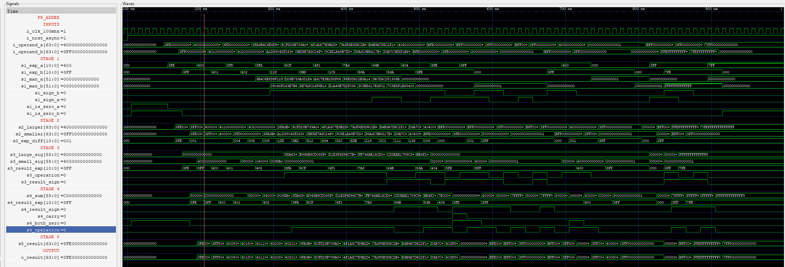
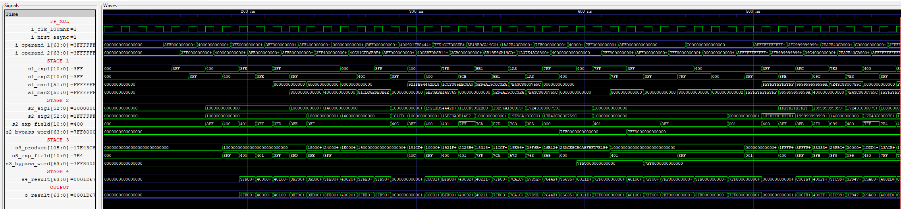
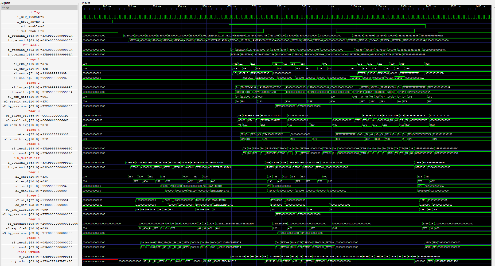
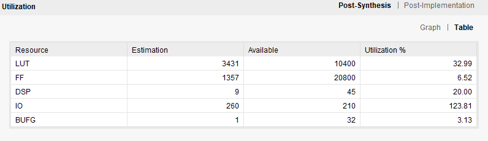

# High-Speed IEEE-754 Floating-Point Arithmetic Unit
Pipelined Adder + Multiplier with a low-power dual-output top. Fully generic (defaults target FP64). RNE rounding. Handles ±0, subnormals, ±∞, NaNs.
## Overview

- Generic format: EXP_WIDTH, MANT_WIDTH, BIAS (e.g., FP64 = 11/52/1023, FP32 = 8/23/127).

- Rounding: Round-to-Nearest, ties-to-even (RNE).

- Special cases: ±0, subnormals, ±∞, NaNs (quiet NaN on invalid ops).

- Throughput: pipelined (Adder = 5 stages, Multiplier = 4 stages).

## Top Module (dual outputs, low power)
- Two enables and two independent results to avoid unnecessary toggling. Pulse an enable for one clock when operands are stable. Each unit asserts its own valid after its pipeline latency.
``` bash 
entity fp_top_dual is
  generic(
    EXP_WIDTH  : integer := 11;
    MANT_WIDTH : integer := 52;
    BIAS       : integer := 1023;
    ADD_LAT    : integer := 5;
    MUL_LAT    : integer := 4
  );
  port(
    i_clk_100MHz : in  std_ulogic;
    i_nrst_async : in  std_ulogic;
    i_add_en     : in  std_ulogic;
    i_mul_en     : in  std_ulogic;
    i_operand_a  : in  std_ulogic_vector(1+EXP_WIDTH+MANT_WIDTH-1 downto 0);
    i_operand_b  : in  std_ulogic_vector(1+EXP_WIDTH+MANT_WIDTH-1 downto 0);
    o_add_valid  : out std_ulogic;
    o_mul_valid  : out std_ulogic;
    o_add_result : out std_ulogic_vector(1+EXP_WIDTH+MANT_WIDTH-1 downto 0);
    o_mul_result : out std_ulogic_vector(1+EXP_WIDTH+MANT_WIDTH-1 downto 0)
  );
end;
```
## Floating-Point Adder

#### Pipeline
- 1. Capture / classify (zero, subnormal, inf, NaN).

- 2. Preparation (choose larger/smaller, exp_diff, add/sub, early-outs).

- 3. Denormalization ([hidden | mant | G R S], shift smaller, sticky).

- 4. Significand add/sub (larger ± smaller), detect exact zero.

- 5. Normalize & round (RNE), post-round overflow, pack.


## Floating-Point Multiplier

#### Pipeline
- 1. Capture / denorm (implicit bits, exponent sum − bias, specials).

- 2. Significand multiply ((MANT_WIDTH+1) × (MANT_WIDTH+1)).

- 3. Normalize (right on top-bit carry, else left-normalize; subnormals).

- 4. Round (RNE) & pack (overflow → ∞).



## Top Module 


## Build, Simulate & Power (GHDL + GTKWave + Python)
This repo includes a one-shot script that:

- compiles and runs the TB with GHDL,

- produces both GHW (for GTKWave) and VCD (for power),

- runs a Python VCD power calculation, and

- opens GTKWave.

### Prerequisites
- GHDL, GTKWave, Python 3
## Run
``` bash 
./sim/compSim.sh
```
## Outputs
- work/result.ghw – waveform for GTKWave

- work/result.vcd – switching activity for power calculations

- work/power_summary.txt – power summary

## Hardware Utilization 
- The current design is not optimized for I/O utilization. 



## Repo Layout 
``` bash 
high-speed-ieee754-floating-point-arithmetic-unit/
├── README.md
├── .gitignore
├── images/
│   ├── image.png
│   ├── image-2.png
│   ├── image-3.png
│   └── image-4.png
├── unitAdder/
│   ├── src/
│   │   └── fp_adder.vhd
│   └── sim/
│       ├── tb_fp_adder.vhd
│       ├── compSim.sh
│       └── work/              
├── unitMultiplier/
│   ├── src/
│   │   └── fp_mul.vhd
│   └── sim/
│       ├── tb_fp_mul.vhd
│       ├── compSim.sh
│       └── work/
├── unitTop/
│   ├── src/
│   │   └── Top.vhd             # FPU Top Module  (adder+ multiplier)
│   └── sim/
│       ├── tb_top.vhd
│       ├── compSim.sh
│       └── work/
└── sim/                        # (TopModule testbench)
    ├── tb_top.vhd
    ├── compSim.sh              # builds adder/mul/top, runs, dumps GHW+VCD, calls power script
    ├── vcd_automation.py       # Python power calc
    └── work/
```

## Reference 
Hardware Realization of High-Speed Area-Efficient Floating Point Arithmetic Unit on FPGA
