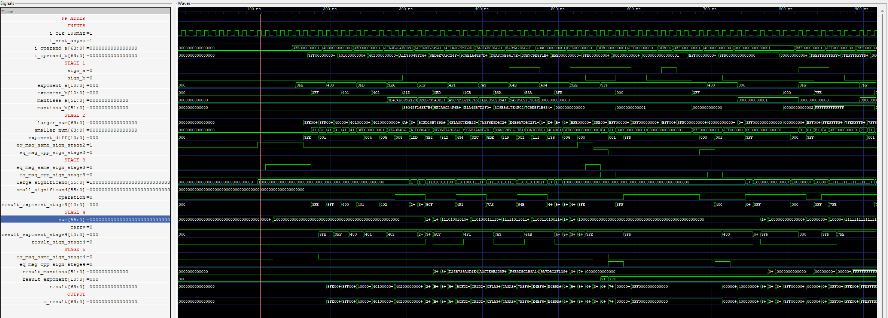

# high-speed-ieee754-floating-point-arithmetic-unitfpga
Implementation of a high speed IEEE-745 floating point arithematic unit on an FPGA (Implementation in Progress)

## Floating Point Numbers 
- Floating point represents integers and fractions with a finite precision.
- IEEE-754 is a standard for representing floating point numbers in computers. 
- Single Precision := 32 bit representation (1 sign bit, 8 exponent bits, 23 mantissa bits).
- Double Precison  := 64 bit representation (1 sign bit, 11 exponent bits, 52 mantissa bits).
- Exponents are always stored in biased notation, as both positive and negative numbers can be represented only using non-negative binary numbers. Using binary noation simplifies comparision allowing floating point numbers to be treated as unsigned integers.
- Floating point representation can represent more #'s in the same #'s of bits than a fixed point can represent.
- Range of #'s in a 32-bit fixed point is := (-32768,32767.9999847412).
- Range of #'s in a 32-bit floating point is := (1.4 x 10^-45,3.4 x 10^38).
## Floating Point Adder
### Floating Point Adder Stages
- Preperation -> Denormalization -> Significand Addition -> Normalization.
- In this project I implemented these stages in a piplined fashion which would increase the throughput.
### Pipelined Implemenation 
- Stage 1 : Capture : Caputring the the sign, exponent and the mantissa of the two operands.
- Stage 2 : Prepration : Comparing the exponents, mantissa's and the signs of both the operands and decide the larger #, smaller # and the exponent difference between the two.
- Stage 3 : Denormalization : Output sign (determined based on the larger #), the mantissa of the larger number is padded with a 1 at the MSB and with a guard bit, round bit and sticky bit at the LSB side. This would increase the size from MANT_WIDTH  to MANT_WIDTH + 4.The same is done with the smaller numbers mantissa but its shifted right by the difference in the exponents determined in the step 2. 
- Stage 4 : Significand Addition : Based on the sign of the two numbers either addition or subtraction is perfromed. In case of subtraction its the addition of the larger significand with the 2's complement of the smaller significand. Which gives the sum and the carry.
- Stage 5 : Normalization : The sum is shifted left such that the MSB is equal to 1 and the exponent is reduced by the number of shifts. Based on the rounding formula the result is rounded by either truncation or adding a 1. The output sign appended with the exponent and the mantissa give the final result.

## Floating Point Multiplier 
### Floating Point Multiplier Stages 
- Denormalization -> Significand Multiplication -> Normalization.
- Implemeted this in a pipelined fashion.
### Pipelined Implementation 
- Stage 1: Capture : Caputring the the sign, exponent and the mantissa of the two operands.
- Stage 2: Denormalization : The exponents of the two numbers are added and the bias is subtracted from the sum. The significand is prepared by appending the mantissa with the implicit bit. The output sign, unnormalized exponent and the significands are determined in this stage.
- Stage 3 : Significand Multiplication : The two significands are multiplied the product is obtained.
- Stage 4 : Normalization : The product is taken and the significand portion of it collected i.e. the first (m+1) bits the roudning operation is performed and the round bit is added to the significand_product. The sign bit the exponent and the significand_product are appeneded to obtain the final result.
![[Piplined FPU Multiplier]](image.png)
### Reference 
